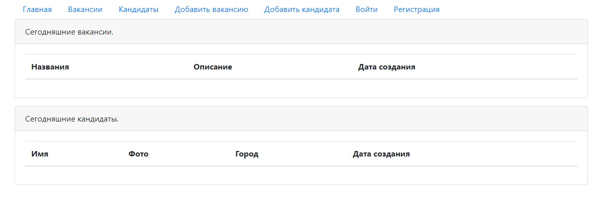
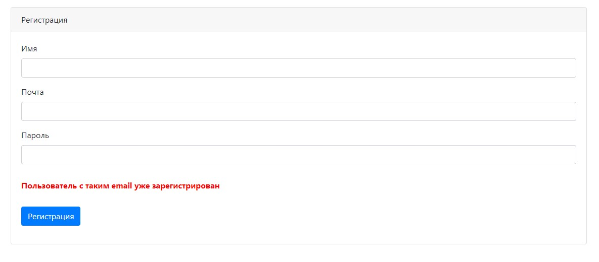
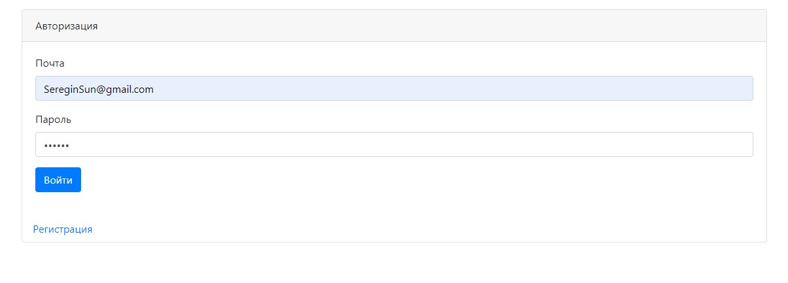
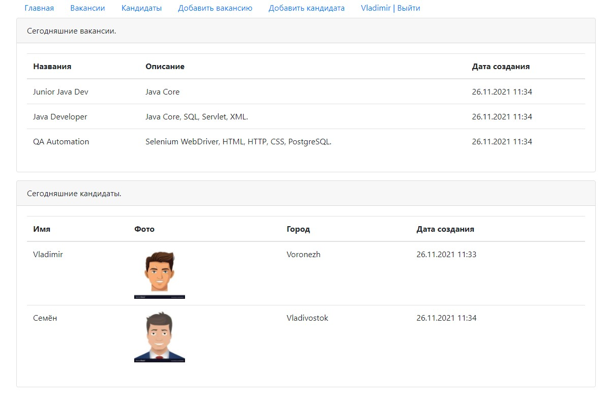
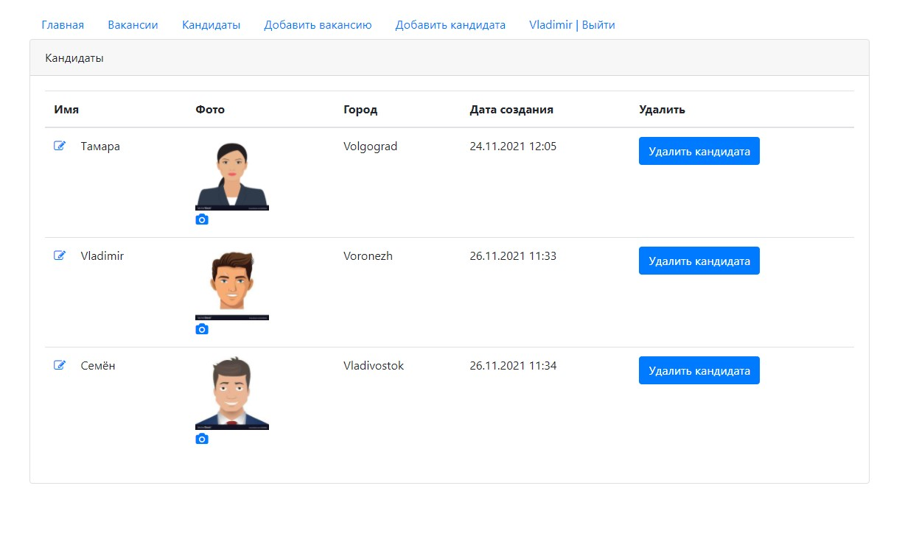
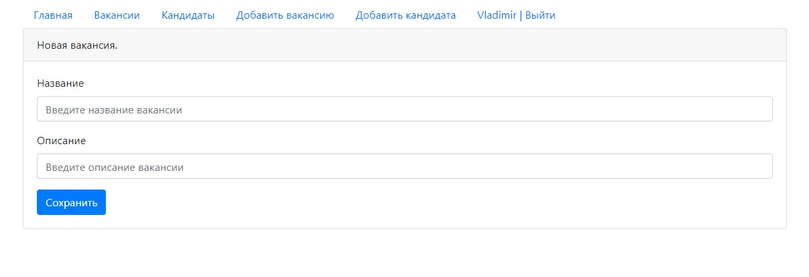
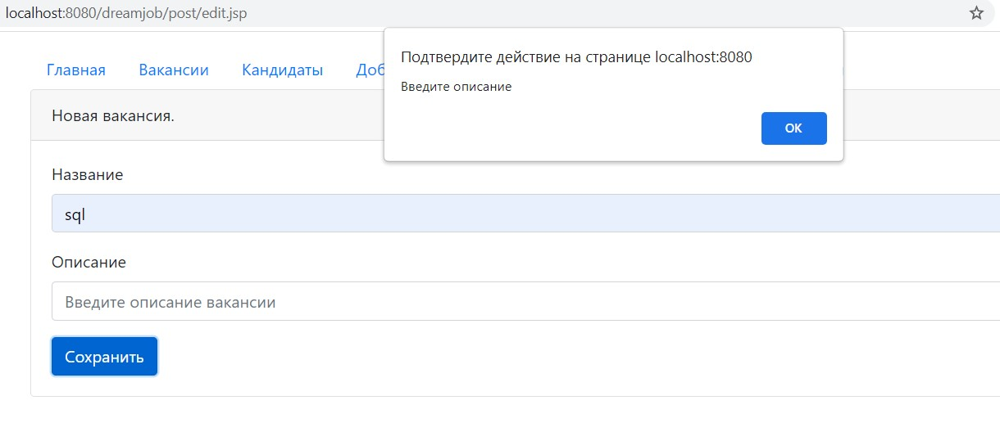

# job4j_dreamjob

##Описание
DreamJob - веб-приложение, представляющее собой биржу труда. В нём предоставляется возможность добавления, редактирования и удаления вакансий и кандидатов.

##Используемые технологии:
 - Java EE Servlet API
 - Apache Tomcat
 - JDBC
 - PostgreSQL, H2
 - Java Script (jQuery, AJAX)
 - HTML, JSP, JSTL
 - Log4j
 - Maven
 - Travis CI
